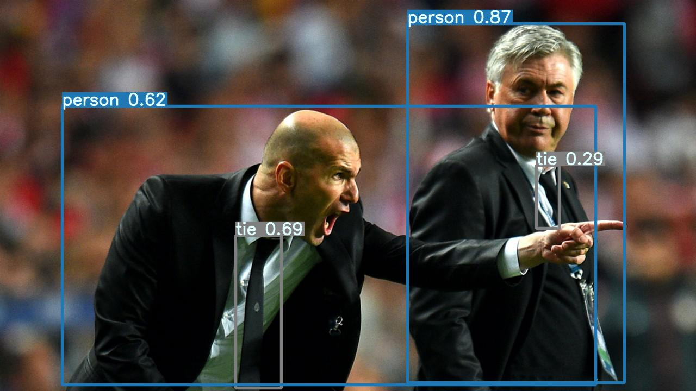
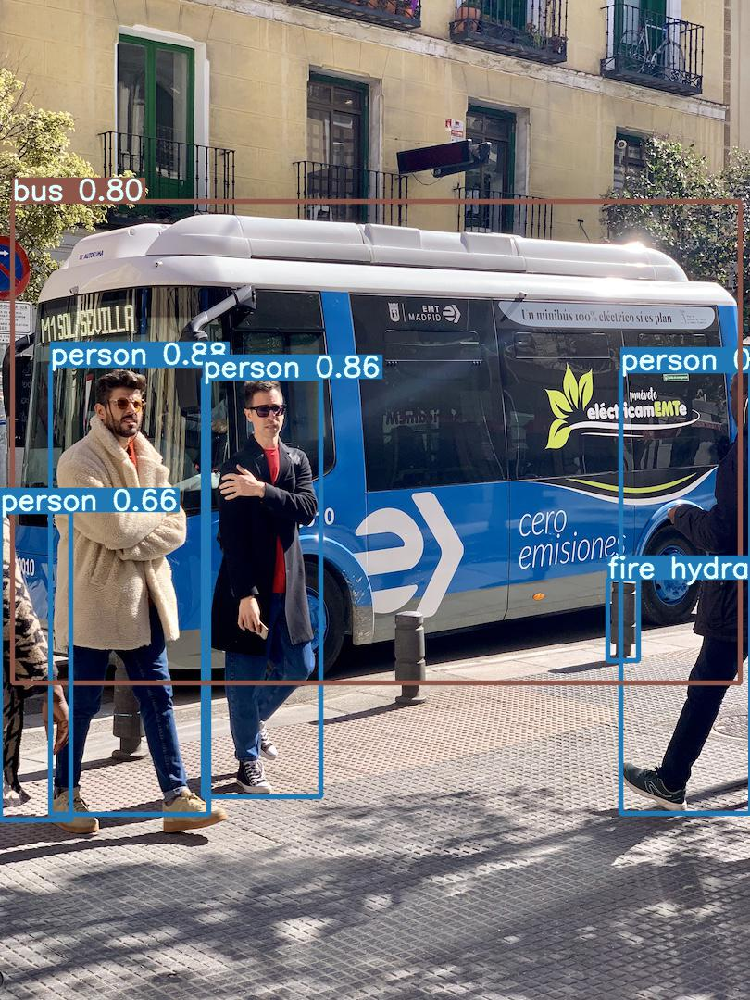

# Documents while Learning YOLO

## About requirements and installation
[Getting-Start](https://docs.ultralytics.com/quick-start/)

## About Learning

### About Training Results and HOW TO TRAIN
Also,it has some tips of Creating your own dataset and how to improve your dataset
[Dataset-and-Models](https://docs.ultralytics.com/tutorials/training-tips-best-results/)

### About Weights and Bias processing,HOW TO CHECK YOUR LOSSES ON TENSORBOARD
[Tensorboard](https://www.tensorflow.org/tensorboard/get_started)

### About Pytorch in YOLO 
Through some of YOLO's code is base on Pytorch Framework and OpenCV APIs,here's the document of Pytorch and OpenCV APIs.

[APIs-Introduce](https://docs.ultralytics.com/tutorials/pytorch-hub/)

#### Pics of these APIs



### About Hyperparameters in Training
[Hyperparameter](https://docs.ultralytics.com/tutorials/hyperparameter-evolution/)


## (UNSUPPORT ON WINDOWS UNTIL 2020)About Multi-GPU Training on Training PC
According by the FLOPs limitted by hardware in Turing's lab.At the very first time,we tried to use Multi-GPUs while training YOLO Framework Network.Though we already have two TITAN X GPUs,but,limitted by Technology and software support,we failed in proceesing with duo GPUs.

[Multi-GPUs-Document](https://docs.ultralytics.com/tutorials/multi-gpu-training/)

More solutions are still coming

something worse is what was said that the other TITAN X had some problems on PCIE Speed

After proving the fact that,it really got some unforseen problems in PCIE speed and Windows CUDA support.In the next time we may turn Training PC into Linux system to get more powerful performance.

Also，there is a good news that on pytorch 1.7.0 or higher version,Windows group and Pytorch are now support Multi-GPU training now,the only thing is that we should add the following codes into `init_progress_group`
```
torch.distributed.init_process_group(	backend="gloo", 
init_method=r"file://{ model path}", 
world_size=args.world_size,   # gpu数
rank=args.rank	)   # rank是本机gpu的编号列表，如2个gpu即为 [0,1]
```

on yolo's code,we can easily find function `os.environ`,now we can define the numbers of GPU you use to train.

more information you can go to [Multi-GPU-on-UBUNTU](https://blog.csdn.net/kejizuiqianfang/article/details/102454278?utm_medium=distribute.pc_relevant.none-task-blog-2~default~BlogCommendFromMachineLearnPai2~default-3.nonecase&depth_1-utm_source=distribute.pc_relevant.none-task-blog-2~default~BlogCommendFromMachineLearnPai2~default-3.nonecase)
