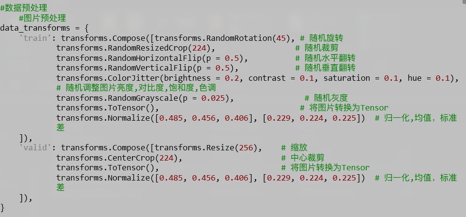
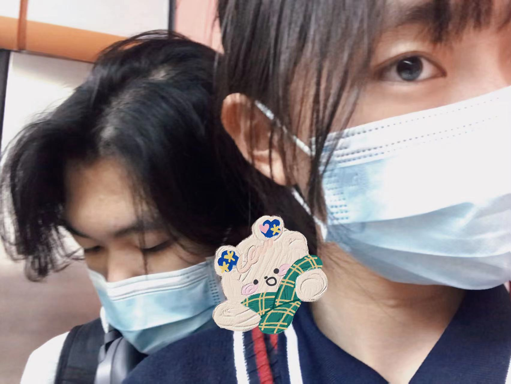
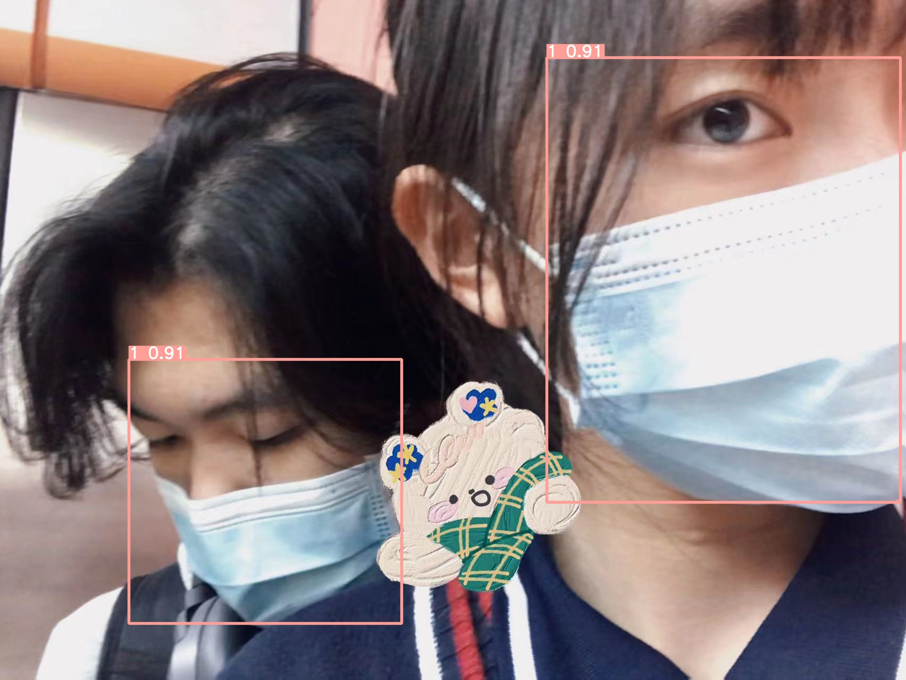
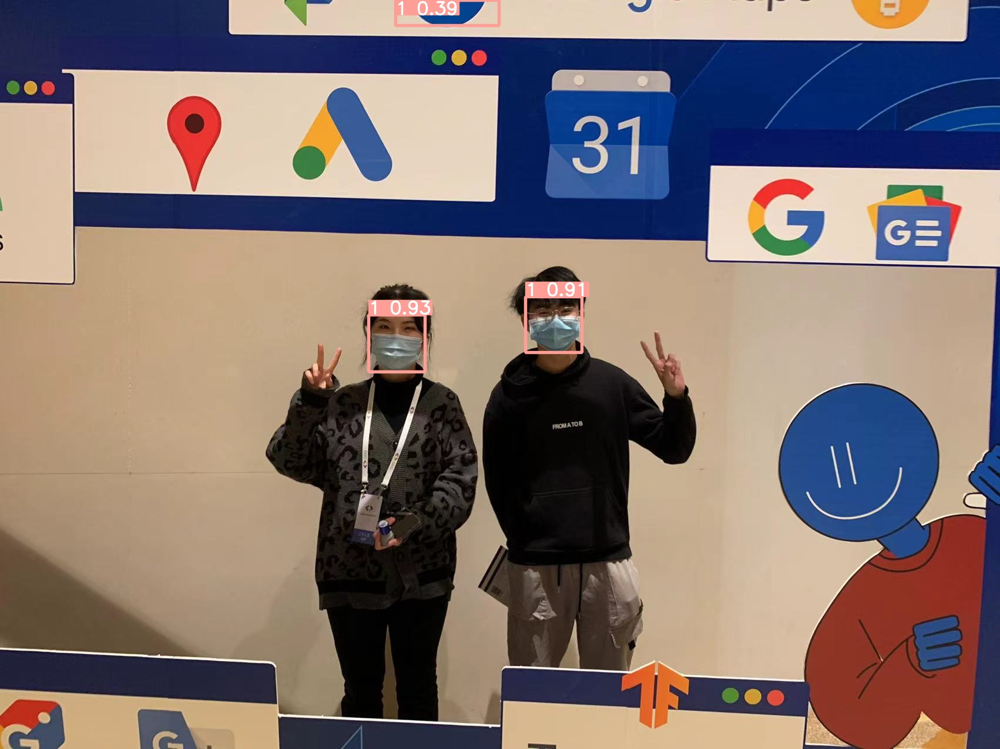
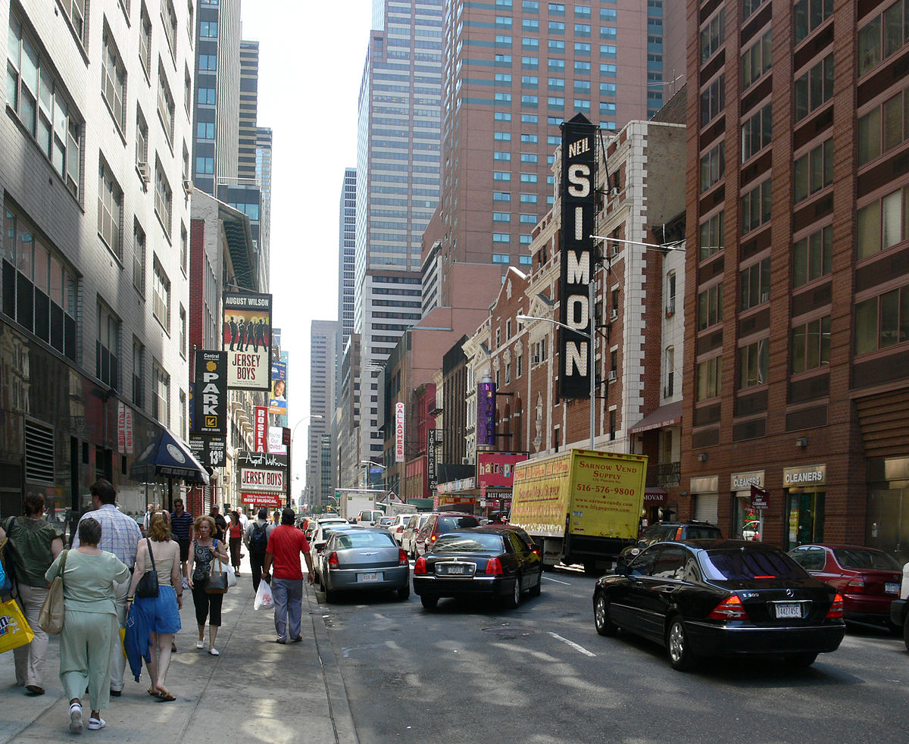
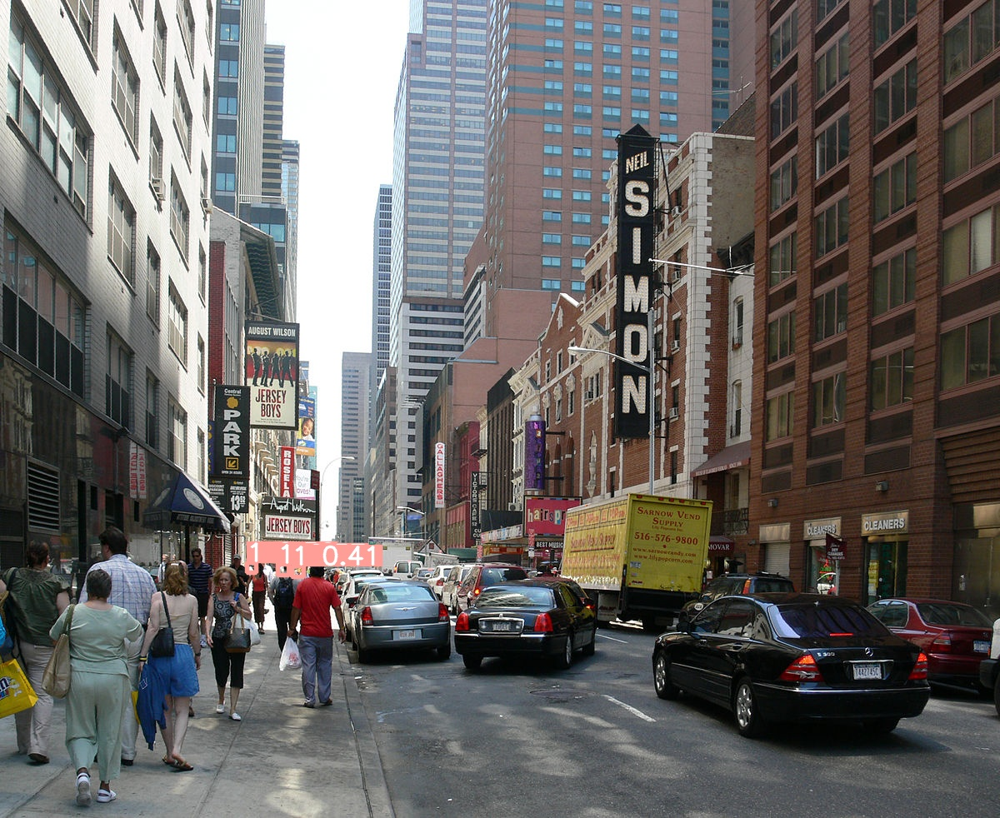
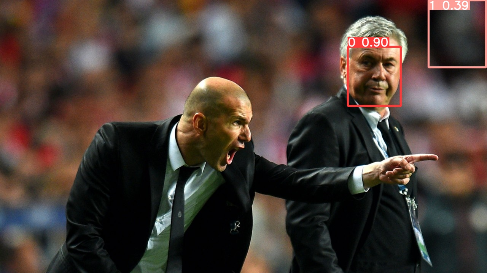
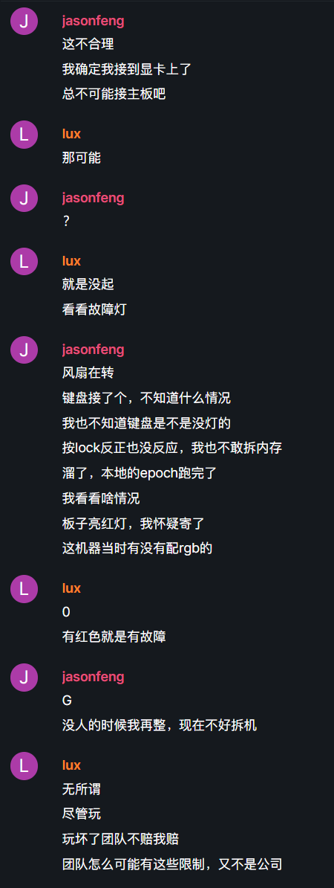
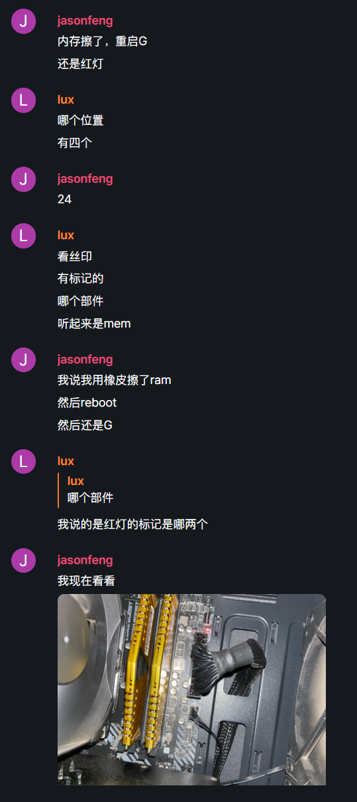
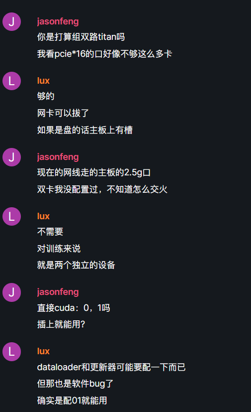

# 小结

## 一、基本任务项

### 1、数据集的使用

数据集使用了**mask-detection-dataset**，约八百张人脸的数据集，类别是**人脸**，标签包含未戴口罩，戴口罩，和戴口罩未遮掩口鼻

### 2、数据集标注
部分数据集使用**makesense**网站进行在线标注，大部分数据集使用已标注好的图片及txt，xml文档。

### 3、图片预处理

#### 3.1、早期
项目早期使用**transformer库**进行了部分数据增强处理，包括但不限于随机旋转，随机裁剪，随机水平旋转，随机垂直旋转，归一化，随机调整亮度、对比度、饱和度及色调等。
代码如下

当然yolo官方也给出了数据增强的api，无需自己对数据集进行增强，api可通过`--multi-scale`开启，默认进行对原始图像的随机尺寸变换。

#### 3.2、后期
后期的数据由于图片量已达到数量要求，原生图片已经可以满足训练需求，后把数据增强模块去除。

### 4、训练过程
本次训练使用**SGD**，即**随机梯度下降**作为训练策略，中途使用过**Adam**训练五百轮作对比，但实际情况并不如**SGD**，但**SGD**算法会出现陷入局部最优的梯度，在一千轮的训练下，**Adam**明显优于**SGD**算法。

### 5、训练权重设置
在早期的框架测试中使用了从头训练，数据集使用**yolov5自带的coco128数据集**，预训练的效果明显优于从头训练的结果，识别率更高。在往后的测试中，笔者分别尝试了不同的训练设置，更多感想将在附加任务中阐述，截止至3月5日14：26，已完成**coco128**的**五百轮**对比训练，**mask-detection**的**五百轮SGD**策略训练，及正在进行**一千轮**SGD训练。

### 6、测试效果

notice：本文出现的所有labels，0表示没有戴口罩，1表示戴口罩并遮掩口鼻，2表示戴了口罩，但是没有遮掩口鼻

原图片

预测效果

原图

预测效果

文件夹中的test是更多图片的测试

文件夹中的video为预测视频的效果

### 7、环境

环境参考链接

[requirements.txt](./requirements.txt)

### 8、使用的文档

文档参考链接

[README.md](./README.md)

## 附加任务

### 对梯度变化的调整与变化
截止至3.5 16：57，近几次的训练效果都不好，尤其是目前使用SGD对模型训练时，截止至第三百轮的best.pt，检测效果并不好，经常出现误判和漏判定，即使对detect进行预测增强，效果依然不是特别好。使用Adam策略又过于激进，过大的lr可能会掠过整体最低点。经过几次的测试，最终将基础的scratch作为hyperp的参数，最初的lr设为1e-2，（SGD模式），在早期的几轮将以比较慢的速度下降，越接近尾声将逐步加快。为了可以检测多目标，iou设成了0.20进行训练，obj设为1，防止出现少判，加快训练进度。热身轮设了三轮，防止污染best，同时加大热身轮的lr，更快确定优化器参数。

对于梯度下降的策略，经过多轮测试，决定将使用Adam。方便，快捷，精准，不易陷入局部最优，且Adam对内存需求小，适合大规模数据集，可以方便的对参数计算不同学习率，更好的更新lr。

同样的，如果没有patience机制，epoch过大过小都会导致欠拟合和过拟合，感谢yolov5中patience机制的引入，现今epoch影响的只有过小导致欠拟合的问题，只需要将epoch优化大一些即可。

bs的问题，由于不存在整体梯度下降的问题，模型仅存在随机梯度下降的问题，bs的过大会导致模型无法在最优值收敛，同样的，过小的bs会耗费大量的时间用于训练，基于硬件限制和笔者基于良好数据集的测试，最终将bs设置为32.

数据集的问题，本人在数据集中已详述大部分，除开垃圾的数据集外，下文的称之为缺失值过多，还有样本不均衡，比如我训练集中有200张戴口罩的图片，而不戴口罩的只有10张。

数据集的过少及标签错误也是因素之一，前者可以通过数据增强解决，标签错误建议/remake

最重要的一点，也是框架中最容易忽略的一点，没shuffle，这将非常大程度影响梯度优化的可选性

最离谱的，权重的initialize都设为0，这个也建议/remake

hyperparameter的设置也有关，调参大师吗，正常

### 对于数据集的看法
截至至上交本summary的时间，笔者应该已经测试完三个不同的数据集，其中包括`coco128`，`Mask-detection`及github上的随机10stars左右的数据集。我分别对此三种数据集使用了同一网络进行训练，`yolov5m`，笔者也在`Mask-detection`中剔除一半的数据，并加入一些自行标注的数据，使用yolov5自带的数据增强。

#### 对于`coco128`
非常优秀的模型，从头开始训练，第约500轮基于Adam的训练就已经有比较好的识别率，虽然在目标重叠的图片中识别率低下，但是仍然做到了良好的识别率。是个非常优秀的训练集

#### 对于笔者魔改过的`Mask-detection`
真正做到了garbage in，garbage out。

同样是500轮，识别率非常低，yolo的教练图中甚至只检测到左边教练的脸并检测出未带口罩，大街图中甚至无法标出所有目标的脸，识别率及其低，可能是训练集不够详尽，细节不够丰富，标注不够细致，数据集过于单一，没有很好的体现优秀的鲁棒性

#### 对于原生的`Mask-detection`
中规中矩，笔者查看了数据集的图片，采集的过于单一，其中不乏数据集作者的自拍，极少看到同一张图有大批量目标的训练图，训练集同样需要改进

#### 对于`Mask-detection`的一致问题
原作者在处理数据的时候非常马虎，标记的png后缀中混进了非常多jpg图片，导致patience机制在约470轮就介入，根本跑不到1000轮，jpg后标的图片会相较于png损失一定颜色信息，将模型错误的导向非最低点，提前让patience介入，属实是将`garbage in,garbage out`贯彻到极致，是个不折不扣的`坏`数据集。

报错的图片可能本来是个png的图片，被命名成别的，或者反过来，linux不看后缀，看里面pattern是什么才会用对应的东西打开，所以可能在libpng里面看到是个奇怪排布的图，总结，此数据集真的非常，非常garbage，一边训练我真的是一边骂娘。

比较明显的检测图见下面

真的是非常离谱的错误

[相关文档可以看这个](https://stackoverflow.com/questions/30709056/libpng-warning-iccp-not-recognizing-known-srgb-profile-that-has-been-edited)

后续本人会在issue提示该作者

#### 对于GitHub随机数据集
[Github-Link](https://github.com/obaby/skip_ads_yolov5)

非常有创意，因为大部分的数据集都比较单一，所以500轮的Adam训练已经有比较不错的识别率，不过训练集貌似没有2345那种变态的三四个取消，不知道会不会误导模型

### 关于训练精度与数据集的一些看法
考核没有，个人想法而已，我认为对数据集进行模糊，增强是必要的，比如纯视觉自动驾驶项目，tesla的解决方式就是在不同天气进行道路测试获得更加庞大的有效数据集，包括但不限于雨天，下雪，大雾等，这将增强算法在极端情况下的判断力。算法应该做到对数据集进行优化而不是人为的优化数据集。

### 对于Pre-Train
`coco128`这类比较普遍的数据集我使用了预训练，当然也使用了不训练，预训练的数据集更容易提前被patience介入，训练的速度会更快，效果当然也会更好

`Mask-Detection`这种我认为，本身不是常用数据集的我就没有开，当然没带口罩的labels开了会更加快。

那个广告的当然不开，开了pretrain居然更慢了，可能是本身不在常用范围内，参数会被影响，不如从头开始train

总体上来说，常用的识别，比如人脸，比如车辆，使用pretrain可以更快完成模型的训练，得到一个更加精准的值，对于一些非常小众，且没有近似目标作为替代的，使用pretrain会降低训练的速度，比如那个广告的训练，patience介入的时间会慢很多

### 结合预训练和一些参数调整的做法
更新于三月6日，14：34.

单卡训练已经没有什么悬念了，说说双卡的训练，在成功组建双卡环境后，我使用了`coco128`作为dataset进行对双卡环境的调参，借由此谈谈我对预训练，调参的一些心得。

起初双卡并不友好，由于内存和cpu瓶颈，我的训练效率并不高，cuda：0设备没有把传自cpu的数据吃满，导致10个epoch的时间大约为6分钟左右，此时显存接近90%占用，我意识到是我参数的设置可能出了问题，bs设置过大只能满足没有pretrain参数的前期训练，确实，如果你认为dataset有足够的自信，你觉得你的dataset包含了所有的基础特征，你可以不使用pretrain，此时，前期的大bs可以完成你没有pretrain情况下的模糊方向确立，这个时候你损失的是方向上的细节。如果是CPU瓶颈，加载入机器的线程成倍增加，内存占用也会增加，出了加内存别无他解。而对于迭代器，我的方式是开四个线程，每个epoch占用1/4的数据空间，每次epoch根据数据随机生成，在bs不变的情况下，对epoch进行加倍，这会减少对内存的占用，同时不会增加太多训练时间。

关于上文中的调参，以及近几日对训练时的感想，上文可能错误的地方仍有许多，在调试双卡环境的时候，最高的时候我将bs设为了60，这个时候bs非常大，且我并没有去更新优化器，让他动态根据epoch和loss对bs进行降低，这将让模型梯度爆炸。目前我认为的最优解是，不管用不用pretrain，目标的bs应该随epoch数降低，比如测试10epoch，他应该在前两轮保持高bs确定训练的方向，然后逐渐降低，最低在bs为4的时候保持，lr也是同理，这样可以让梯度在epoch的末期缓慢收敛到一个最优值。如果是有pretrain的情况下，个人认为的最大bs差不多也就是32，越到后期更应该降低lr和bs，按照个人的曲线计算，同样是10个epoch，我希望最后一轮的epoch的bs为2，非常精细的训练，那第一轮设置的bs最大也就是16，根据你需要最后几轮的bs和总共的epoch可以倒推。

同理，大的bs训练是为了让pretrain参数适应我目前模型的数据空间，适应我的任务，小的bs用来学习我这个任务的用例，如果是有pretrain参数的加入，数据空间在一开始的几轮大bs训练中就已经被做好了，不需要对其他参数进行大范围修改。所以我个人认为，如果权重不是从0开始，我并不认为超大的bs可以对模型的拟合起到任何作用。对于目标检测这个方向，数据空间大抵重合，因为搜索范围的不一样，pretrain函数很有必要使用，又因为范围可能和pretrain的范围不一样，载入pretrain之后的热身轮要自行训练，当然前文所述，对数据集有绝对自信的，可以跳过pretrain，直接热身轮。

对于pretrain，同属一个类的任务中，bs的大小取决于训练时想从pretrain参数中获得多少数据，如果一开始就是小lr小bs，那就基本是顺着pretrain参数走。但是，如果是从大的bs开始训练，这将会截断pretrain中的高级认知，但是又因为同属找特征，目标搜索这样的基础，这时候需要你后续的小bs和小lr确定你自己的精度和目标。当然，pretrain的好处是优先使用pretrain训10个epoch左右，拿到best pt，再使用这个作为pretrain，走finetune。

对于我的理解，pretrain的作用就是规定数据空间，pretrain轮的bs越大，规定的数据空间越准确，当然pretrain的有用程度也不一样，训练的时候你认为pretrain对dataset多没用，你的bs就应该越大越好，由此使得数据空间偏移，同时lr要小，不然数据会跑到空间外，如果lr过大，那近乎等于没有pretrain，从头训练。

打个比方，x是我的batch，f是pretrain的权重，y是我的dataset，越大的x会让y在方向上更加精准，更加接近整体下降，但是细节会非常模糊，此时y对f更新也会是上述的情况，这个时候f就会快速向目标方向收敛，但是缺失绝大部分细节，这是我们希望数据走向的基础，因为pretrain保留了细节。越大的bs会让pretrain的细节更新越少，这是热身轮中的好操作。后期的更新lr和bs也是finetrue的基操，通过优化器解决

至于YOLO的documents提到的建议使用机器上限的batch——size进行大规模，多epoch训练，经我与师兄讨论，认定为documents默认使用者机器的极限为16左右，无法支持太大bs的训练，故在documents中建议大bs的训练方式。后续将在精细化finetune中标记数据走向和loss曲线。当然，出于对documents的尊重，本人也会在末期采用大规模的bs进行对比训练，对比测试两种训练方式的最终loss。

## 一些看法和最后的总结
从接到考核开始，到这篇总结的写完（不包括后续更新和调参），大约耗时四日左右，周四之前的训练都是在3060的笔记本上运行，读完文档和api，配置好环境大约花了我一天多的时间，周四晚上修好训练机，配置好训练机的环境开始训练，周五上午之前已经完成了主干代码的理解，调参的方式和数据集的处理与标记

期间经历了各种硬件的折腾，终于在周五上午resume模型的训练，提交完考核后将尝试将训练机升级为双卡，进一步加快后面训练的进度，减少耗在训练上的时间

大约将近50h的时间，一共在训练机上训练了5次左右，期间在笔记本上完成下一次训练的数据集和调参，好在有训练机，使得我现在在写markdown的时候机器还在跑口罩的最后一次调参测试，测试得到的数据将作为最后的部分写在基础考核

关于训练的参数，后期版本的yolov5加入了patience机制后可以无脑堆epoch，反正不会过拟合，只要数量上去了，就会在较为平稳处停止训练，遍历了大约上千次log之后梯度爆炸会在`mask`中出现，初步认定是垃圾数据没洗干净导致的

总体上我并没有觉得某些环节会突发卡壳或发生过多意外，策略的优化我并没有采用过多的算法，yolo本身仅原生写了SGD和Adam的切换，有了较好的机器后我对比了3060和TITANx环境的精度，训练机用大的bs的精度有时候还会好过3060的数据，当然也有可能是我没有用3060跑过非常大量epoch的原因。

## 关于resnet
早期在我的电脑上跑过resnet50，进度很慢，且数据集是多种类的花卉识别，后期将尝试在训练机上分布式大规模跑一下resnet看看识别率。
